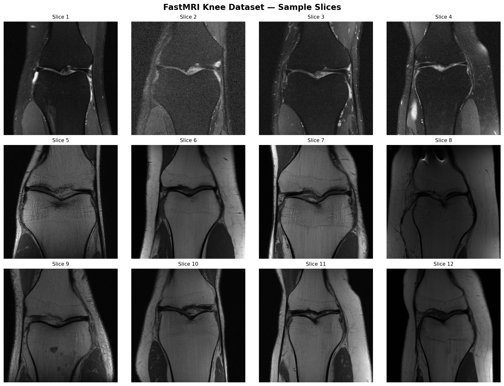
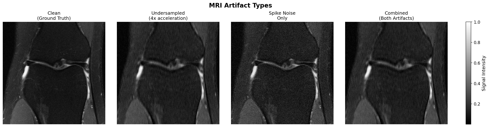
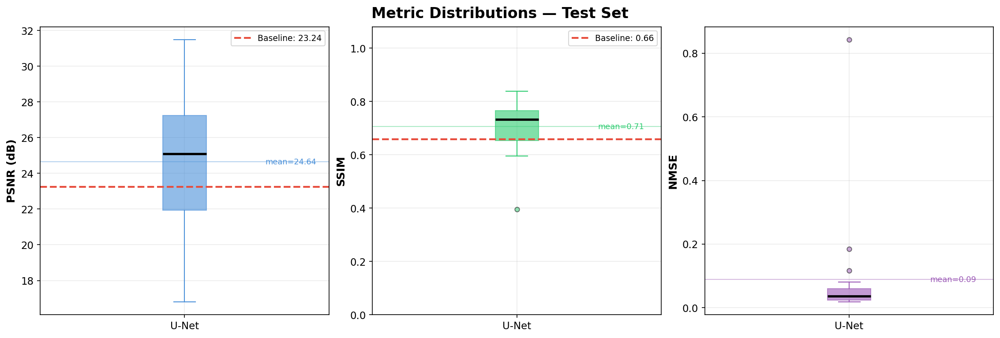
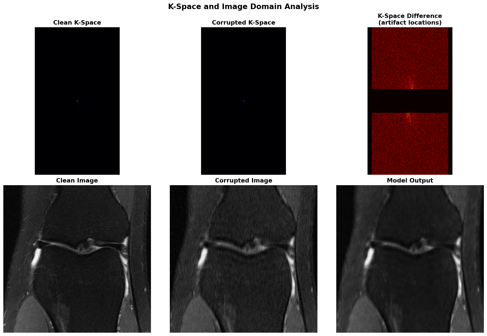
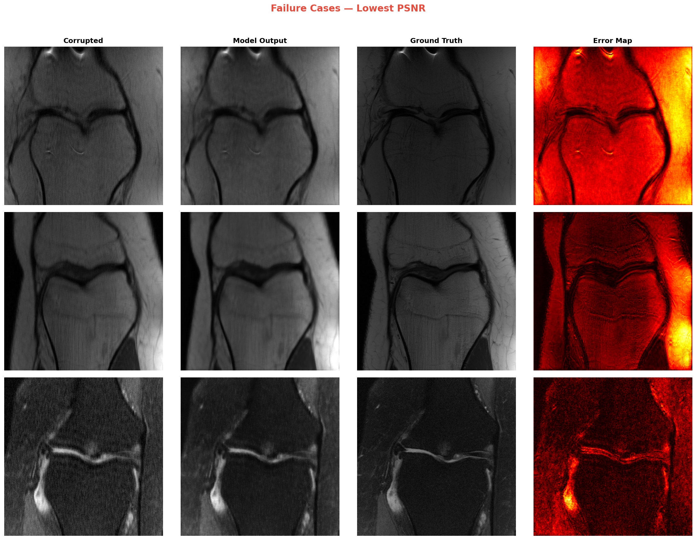

<p align="center">
  
</p>

<h1 align="center"> Deep Learning for MRI Artifact Correction</h1>

<p align="center">
  <strong>Accelerated MRI Reconstruction using U-Net with Residual Learning</strong>
</p>

<p align="center">
  <a href="#overview">Overview</a> •
  <a href="#motivation">Motivation</a> •
  <a href="#methodology">Methodology</a> •
  <a href="#results">Results</a> •
  <a href="#installation">Installation</a> •
  <a href="#future-work">Future Work</a>
</p>

<p align="center">
  
  
  
  
</p>

---

# Overview

This project implements a **deep learning-based approach for correcting artifacts in Magnetic Resonance Imaging (MRI)** scans. MRI is a critical diagnostic tool in clinical medicine, but scan times can exceed 30-60 minutes, causing patient discomfort and limiting throughput. **Accelerated MRI** techniques reduce scan time by undersampling k-space (frequency domain) data, but this introduces aliasing artifacts that degrade image quality.

This work demonstrates that a **U-Net architecture with residual learning** can effectively suppress artifacts from:
- **Undersampled k-space** (4× acceleration factor)
- **Spike noise** (hardware-induced anomalies)

achieving a **+1.40 dB PSNR improvement** over zero-filled reconstruction baseline.

### Key Contributions

1. **Custom FFT Implementation**: Implemented the Fast Fourier Transform from scratch using the Cooley-Tukey algorithm, demonstrating deep understanding of the mathematical foundations of MRI reconstruction.

2. **Multi-Artifact Simulation Pipeline**: Developed a realistic artifact simulator combining undersampling patterns and spike noise for training data augmentation.

3. **Residual Learning Framework**: Employed residual learning (`output = input + model(input)`) to learn artifact corrections rather than full image reconstruction, improving training stability.

4. **Comprehensive Evaluation**: Rigorous quantitative assessment using PSNR, SSIM, and NMSE metrics with honest analysis of failure cases.

---

# Motivation

### The Clinical Problem

| Challenge | Impact |
|-----------|--------|
| Long scan times (30-60 min) | Patient discomfort, motion artifacts, limited throughput |
| Accelerated scanning | Introduces aliasing artifacts from undersampled k-space |
| Hardware glitches | Spike noise corrupts frequency domain data |
| Image quality degradation | Compromises diagnostic accuracy |

### Why Deep Learning?

Traditional reconstruction methods like **GRAPPA** and **Compressed Sensing** rely on hand-crafted priors and iterative optimization. Deep learning offers:

- **Data-driven priors**: Learn anatomical structures from thousands of MRI scans
- **Fast inference**: Single forward pass vs. iterative optimization
- **Flexibility**: Handle multiple artifact types simultaneously

---

# Methodology

### System Architecture

```

+---------------------------------------------------------------------------+
|                    MRI ARTIFACT CORRECTION PIPELINE                       |
+---------------------------------------------------------------------------+

    +-----------+   +---------------+   +--------+   +------------------+
    |  K-Space  |-->| Artifact      |-->|  IFFT  |-->|  Corrupted Image |
    |  (Clean)  |   | Simulation    |   |        |   |                  |
    +-----------+   +---------------+   +--------+   +--------+---------+
                                                    |
                                                    v
                         +--------------------------+---------------------------+
                         |              - Undersampling (4x accel)              |
                         |              - Spike Noise (5 spikes)                |
                         +------------------------------------------------------+

                                                    |
                                                    v
                                         +-------------------------+
                                         |        U-Net            |
                                         |    (Residual Mode)      |
                                         |  output = input + corr. |
                                         +-----------+-------------+
                                                     |
                                                     v
                           +----------------+    Loss (L1 + SSIM)    +-----------+
                           | Reconstructed  | <--------------------- | Ground    |
                           |    Image       |                        | Truth     |
                           +----------------+                        +-----------+


```

### Data Pipeline

**Dataset**: [NYU fastMRI](https://fastmri.org/) Knee Dataset (Single-coil)
- **Training**: 160 slices with on-the-fly artifact augmentation
- **Validation**: 40 slices
- **Image Size**: 256 × 256 pixels

<p align="center">
  
  <br>
  <em>Figure 1: Sample slices from the fastMRI knee dataset showing anatomical diversity</em>
</p>

### Artifact Simulation

We simulate two clinically-relevant artifact types:

<p align="center">
  
  <br>
  <em>Figure 2: Visualization of artifact types — (a) Clean ground truth, (b) 4× undersampled, (c) Spike noise only, (d) Combined artifacts</em>
</p>

#### 1. K-Space Undersampling

Simulates accelerated MRI acquisition by retaining only a fraction of k-space lines:

```python
# Undersampling mask creation
mask[::acceleration_factor, :] = 1.0  # Keep every Rth line
mask[center_start:center_end, :] = 1.0  # Fully sample center (16%)
```

- **Acceleration Factor (R)**: 4× (retains ~25% of k-space)
- **Center Fraction**: 16% (preserves low-frequency content)
- **Effect**: Coherent aliasing artifacts in image domain

#### 2. Spike Noise

Simulates hardware glitches that corrupt individual k-space points:

```python
spike_value = amplitude * np.exp(1j * phase)  # Complex spike
corrupted_kspace[y, x] += spike_value
```

- **Number of Spikes**: 5 per image
- **Amplitude**: 1.5-4× median k-space magnitude
- **Effect**: Herringbone/striping patterns in image domain

# Network Architecture


<p align="center">
  
  <br>
  <em>Figure : U-Net architecture with Attention, ASPP, and Deep Supervision</em>
</p>


**U-Net** encoder-decoder with skip connections:

```


+======================================================================================================+
|                                     DETAILED U-NET ARCHITECTURE                                      |
+======================================================================================================+

  Input
  [1 × 256 × 256]
     |
     v
  +-----------------------------------+                 +-------------------------------------------------+
  |           ENCODER                 |                 |                     BOTTLENECK                  |
  | (downsampling path / skip outputs)|                 |  Residual Double-Conv  &  ASPP (proj → 1024 ch) |
  +-----------------------------------+                 +-------------------------------------------------+
  |  EncBlock1:                       |                 |  Conv3×3 + BN + ReLU                            |
  |   - double Conv 3×3 → 32 ch       |                 |  Conv3×3 + BN + ReLU                            |
  |   - Output: 32 × 256 × 256        |                 |  Feature maps: 1024                             |
  +-----------------------------------+                 |  Output: 1024 × 8 × 8                           |
            |                                           + ----------------------------------------------- +
            | pool 2×2                                           |
            v                                                    |
  +-----------------------------------+                          |
  |  EncBlock2:                       |                          |
  |   - double Conv 3×3 → 64 ch       |                          |
  |   - Output: 64 × 128 × 128        |                          |
  +-----------------------------------+                          |
            | pool 2×2                                           |
            v                                                    |
  +-----------------------------------+                          |
  |  EncBlock3:                       |                          |
  |   - double Conv 3×3 → 128 ch      |                          |
  |   - Output: 128 × 64 × 64         |                          |
  +-----------------------------------+                          |
            | pool 2×2                                           |
            v                                                    |
  +-----------------------------------+                          |
  |  EncBlock4:                       |                          |
  |   - double Conv 3×3 → 256 ch      | <------------------------+
  |   - Output: 256 × 32 × 32         |        skip S4 (to decoder)
  +-----------------------------------+
            | pool 2×2
            v
  +-----------------------------------+
  |  EncBlock5:                       |
  |   - double Conv 3×3 → 512 ch      |
  |   - Output: 512 × 16 × 16         |
  +-----------------------------------+
            |
            v
  (→ flows into Bottleneck box above)

  ------------------------------------------------------------------------------------------------------------------------------------------------
  DECODER (upsampling path with skips & attention)                                   Notes:
                                                                                    - "Concat(Skips)" means: concat feature maps from encoder
                                                                                    - Attention gates can be applied to each skip before concat
  ------------------------------------------------------------------------------------------------------------------------------------------------
            ^
            | upconv 2×2 (proj)   <---  from Bottleneck output (1024 × 8 × 8)
            |
  +-----------------------------------+                                 +-----------------------------------+               
  |  DecBlock1:                       |  <--- Concat(attn(S4), upconv)  |  DecBlock2:                       |
  |   - UpConv 2×2 1024→512           |  -----------------------------> |   - UpConv 2×2 512→256            |
  |   - double Conv → 512 ch          |                                 |   - double Conv → 256 ch          |
  |   - Output: 512 × 16 × 16         |                                 |   - Output: 256 × 32 × 32         |
  +-----------------------------------+                                 +-----------------------------------+
            |                                                                |
            | upconv 2×2 512→256                                             | upconv 2×2 256→128
            v                                                                v
  +-----------------------------------+                                 +--------------------------------+
  |  DecBlock3:                       |  <--- Concat(attn(S3), upconv)  |  DecBlock4:                    |
  |   - double Conv → 128 ch          |  -----------------------------> |   - double Conv → 64 ch        |
  |   - Output: 128 × 64 × 64         |                                 |   - Output: 64 × 128 × 128     |
  +-----------------------------------+                                 +--------------------------------+
            |                                                                |
            | upconv 2×2 128→64                                               | upconv 2×2 64→32
            v                                                                v
  +-----------------------------------+                                 +--------------------------------+
  |  DecBlock5:                       |  <--- Concat(attn(S1), upconv)  |  OUTPUT HEAD                   |
  |   - double Conv → 32 ch           |  -----------------------------> |   - 1×1 Conv (32 → 1)          |
  |   - Output: 32 × 256 × 256        |                                 |   - Output logits: [1×256×256] |
  +-----------------------------------+                                 +--------------------------------+

  Deep Supervision:
    - attach aux 1×1 conv heads on DecBlock2 / DecBlock3 outputs,
      upsample to full resolution and combine for deep supervision loss.

  Note:
    - "double Conv 3×3" = Conv3×3 → BN → ReLU → Conv3×3 → BN → ReLU (+ optional residual 1×1)
    - Pool = MaxPool 2×2, UpConv = Transposed Conv 2×2 (learned upsampling)
    - Attn(Skips) = lightweight gating (1×1 convs) to focus skip features before concat
    - ASPP = parallel atrous 3×3 branches + image pooling + 1×1 projection (used in Bottleneck)
    - Spatial dims assume input 256×256. Channel numbers shown for each block.

  Estimated params: ~41.2M (example architecture; will vary with bias/BN choices)


--------------------------------------------------------------------------------------------------------------------------------------


Input: [1, 256, 256]

ENCODER
  EncBlock1 (no pool output):  -> [32, 256, 256]
    - double conv3×3 (1 → 32), BN, ReLU; conv3×3 (32 → 32), BN, ReLU; residual 1×1 if needed
    - Pool2×2 -> [32,128,128]

  EncBlock2 -> [64,128,128]  (double conv 32->64, pool -> [64,64,64])
  EncBlock3 -> [128,64,64]   (double conv 64->128, pool -> [128,32,32])
  EncBlock4 -> [256,32,32]   (double conv 128->256, pool -> [256,16,16])
  EncBlock5 -> [512,16,16]   (double conv 256->512, pool -> [512,8,8])

BOTTLENECK
  - Residual double conv: 512 -> 1024 -> 1024 at spatial 8×8
  - ASPP: 1×1(1024→256), 3×3 dilated (r=6,12,18) 1024→256 each, concat (4*256=1024) → 1×1(1024→1024)

DECODER (mirror + attention)
  DecBlock1: UpConv (1024→512) -> [512,16,16]; attention on skip; concat -> conv block -> [512,16,16]
  DecBlock2: UpConv (512→256) -> [256,32,32]; concat -> conv block -> [256,32,32]
  DecBlock3: UpConv (256→128) -> [128,64,64]; concat -> conv block -> [128,64,64]
  DecBlock4: UpConv (128→64)  -> [64,128,128]; concat -> conv block -> [64,128,128]
  DecBlock5: UpConv (64→32)   -> [32,256,256]; concat -> conv block -> [32,256,256]

FINAL
  1×1 conv: 32 → 1 (segmentation logits) -> [1,256,256]


```

### Training Strategy

| Hyperparameter | Value | Rationale |
|----------------|-------|-----------|
| **Optimizer** | Adam | Adaptive learning rates for sparse gradients |
| **Learning Rate** | 1×10⁻⁴ | Conservative to prevent mode collapse |
| **Loss Function** | 0.84·L1 + 0.16·(1-SSIM) | Balance pixel accuracy and perceptual quality |
| **Batch Size** | 4 | Memory-constrained optimization |
| **Epochs** | 100 | Early stopping via LR scheduler |
| **Residual Learning** | ✓ | Model predicts correction, not full image |

#### Why Residual Learning?

Instead of learning: `f(corrupted) = clean`

We learn: `f(corrupted) = clean - corrupted` (the correction)

**Benefits**:
- Easier optimization (correction is sparse)
- Identity initialization (zero correction = identity mapping)
- Better gradient flow for small artifacts

### Loss Function

Combined **L1** and **SSIM** loss:

```python
loss = α · L1(pred, target) + (1-α) · (1 - SSIM(pred, target))
```

Where α = 0.84 emphasizes pixel-wise accuracy while maintaining structural fidelity.

**SSIM Implementation**: Fully differentiable PyTorch implementation using Gaussian-weighted local statistics (window size = 11, σ = 1.5).

---

# Results

### Training Dynamics

<p align="center">
  
  <br>
  <em>Figure 3: Training progression — (Left) Loss convergence, (Center) Validation PSNR, (Right) Validation SSIM</em>
</p>

**Key Observations**:
- Stable convergence with no mode collapse
- Best validation PSNR: **24.41 dB** achieved at epoch ~45
- Best validation SSIM: **0.804**
- Minimal train-validation gap indicates good generalization

### Quantitative Evaluation

| Metric | Baseline (Zero-filled) | U-Net (Ours) | Improvement |
|--------|------------------------|--------------|-------------|
| **PSNR** | 23.24 ± 2.1 dB | **24.64 ± 2.8 dB** | **+1.40 dB** |
| **SSIM** | 0.66 ± 0.08 | **0.71 ± 0.10** | **+0.05** |
| **NMSE** | — | **0.09 ± 0.15** | — |

<p align="center">
  
  <br>
  <em>Figure 4: Distribution of evaluation metrics across test set with baseline comparison</em>
</p>

### Qualitative Results

<p align="center">
  
  <br>
  <em>Figure 5: Visual comparison — Corrupted input → Model reconstruction → Ground truth → Error map</em>
</p>

**Observations**:
- Effective suppression of aliasing artifacts from undersampling
- Reduction of spike noise-induced stripes
- Preservation of fine anatomical structures (cartilage, meniscus)
- Residual errors concentrated at high-contrast edges

### K-Space Domain Analysis

<p align="center">
  
  <br>
  <em>Figure 6: Frequency domain visualization showing artifact locations and reconstruction quality</em>
</p>

### Failure Case Analysis

Transparent reporting of challenging cases:

<p align="center">
  
  <br>
  <em>Figure 7: Worst-performing reconstructions (lowest PSNR) — Error maps reveal challenges at tissue boundaries</em>
</p>

**Failure Modes Identified**:
1. High-contrast boundaries (bone-cartilage interface)
2. Fine structural details (thin cartilage layers)
3. Cases with severe combined artifacts

---

# Installation

### Prerequisites

- Python 3.8+
- CUDA-capable GPU (recommended)
- 8GB+ RAM

### Setup

```bash
# Clone repository
git clone https://github.com/yourusername/mri-artifact-correction.git
cd mri-artifact-correction

# Create virtual environment
python -m venv venv
source venv/bin/activate  # Linux/Mac
# venv\Scripts\activate  # Windows

# Install dependencies
pip install -r requirements.txt
```

### Requirements

```
torch>=2.0.0
numpy>=1.21.0
h5py>=3.7.0
scikit-image>=0.19.0
matplotlib>=3.5.0
tqdm>=4.64.0
```

### Data Setup

1. Register and download fastMRI dataset from [fastmri.org](https://fastmri.org/)
2. Place knee singlecoil data in `data/singlecoil_val/`

---

## Usage

### Training

```bash
# Default training (100 epochs, 200 slices)
python src/train.py

# Custom configuration
python src/train.py --epochs 150 --batch_size 8 --lr 5e-5

# Resume from checkpoint
python src/train.py --resume
```

### Evaluation

```bash
# Evaluate trained model
python src/evaluate.py

# Custom evaluation
python src/evaluate.py --checkpoint outputs/models/best_model.pth --num_samples 50
```

### Project Structure

```
mri-artifact-correction/
│
├── src/
│   ├── data/
│   │   ├── fastmri_loader.py   # HDF5 data loading interface
│   │   ├── artifacts.py        # Artifact simulation (undersampling + spikes)
│   │   └── dataset.py          # PyTorch Dataset with on-the-fly augmentation
│   │
│   ├── models/
│   │   ├── Unet.py             # U-Net architecture implementation
│   │   └── losses.py           # L1 + SSIM combined loss
│   │
│   ├── utils/
│   │   ├── fft.py              # Custom FFT/IFFT implementation
│   │   ├── metrics.py          # PSNR, SSIM, NMSE evaluation
│   │   └── visualization.py    # Figure generation utilities
│   │
│   ├── train.py                # Training script with residual learning
│   └── evaluate.py             # Comprehensive evaluation pipeline
│
├── outputs/
│   ├── models/                 # Saved checkpoints
│   ├── figures/                # Generated visualizations
│   └── results/                # JSON evaluation results
│
├── data/                       # fastMRI dataset (not tracked)
├── requirements.txt
└── README.md
```

---

# Future Work

> **Note**: This project is under active development. The following enhancements are planned:

### Short-term Goals (v2.0)

- [ ] **Attention Mechanisms**: Integrate channel and spatial attention (CBAM) to focus on artifact-affected regions
- [ ] **Perceptual Loss**: Add VGG-based perceptual loss for improved visual quality
- [ ] **Data Augmentation**: Implement geometric transforms, intensity variations
- [ ] **Larger Dataset**: Scale to full fastMRI training set (~35,000 slices)

### Medium-term Goals (v3.0)

- [ ] **Comparative Study**: Benchmark against GRAPPA, Compressed Sensing, and other DL methods (VarNet, E2E-VarNet)
- [ ] **Multi-coil Reconstruction**: Extend to parallel imaging with coil sensitivity estimation
- [ ] **Architecture Search**: Evaluate Transformers (SwinUNet), cascaded networks, and unrolled optimization

### Long-term Vision

- [ ] **Clinical Validation**: Collaborate with MRI / MR Physics Researcher for diagnostic quality assessment
- [ ] **Real-time Inference**: Optimize for deployment on clinical scanners
- [ ] **Cross-anatomy Generalization**: Extend to brain, cardiac, and abdominal MRI
- [ ] **Uncertainty Quantification**: Bayesian deep learning for confidence estimation

---

## Technical Deep Dive

### FFT Implementation from Scratch

A key educational component of this project was implementing the Fast Fourier Transform using the **Cooley-Tukey algorithm**:

```python
def fft_1d_scratch(x: np.ndarray) -> np.ndarray:
    """
    Recursive Cooley-Tukey FFT: O(N log N)
    
    X[k] = FFT_even[k] + W_N^k · FFT_odd[k]
    X[k+N/2] = FFT_even[k] - W_N^k · FFT_odd[k]
    """
    N = len(x)
    if N <= 1:
        return x
    if N % 2 != 0:
        return dft_naive(x)  # Fallback for odd sizes
    
    even = fft_1d_scratch(x[0::2])
    odd = fft_1d_scratch(x[1::2])
    
    W = np.exp(-2j * np.pi * np.arange(N // 2) / N)  # Twiddle factors
    
    return np.concatenate([even + W * odd, even - W * odd])
```

This demonstrates understanding of:
- Divide-and-conquer algorithm design
- Complex arithmetic in signal processing
- MRI k-space conventions (centered FFT)

### Differentiable SSIM Loss

The SSIM loss is fully differentiable for end-to-end training:

```python
# Gaussian-weighted local statistics
mu_x = F.conv2d(prediction, gaussian_window, padding=pad, groups=channels)
mu_y = F.conv2d(target, gaussian_window, padding=pad, groups=channels)

sigma_x2 = F.conv2d(prediction**2, gaussian_window, ...) - mu_x**2
sigma_y2 = F.conv2d(target**2, gaussian_window, ...) - mu_y**2
sigma_xy = F.conv2d(prediction * target, gaussian_window, ...) - mu_x * mu_y

# SSIM formula (Wang et al., 2004)
ssim_map = ((2*mu_x*mu_y + C1) * (2*sigma_xy + C2)) / 
           ((mu_x**2 + mu_y**2 + C1) * (sigma_x2 + sigma_y2 + C2))

loss = 1 - ssim_map.mean()
```

---

## 📖 References

1. Zbontar, J., et al. "fastMRI: An Open Dataset and Benchmarks for Accelerated MRI." *arXiv:1811.08839* (2018).

2. Ronneberger, O., Fischer, P., & Brox, T. "U-Net: Convolutional Networks for Biomedical Image Segmentation." *MICCAI* (2015).

3. Wang, Z., et al. "Image Quality Assessment: From Error Visibility to Structural Similarity." *IEEE TIP* (2004).

4. Lustig, M., Donoho, D., & Pauly, J. M. "Sparse MRI: The Application of Compressed Sensing for Rapid MR Imaging." *Magnetic Resonance in Medicine* (2007).

5. Hammernik, K., et al. "Learning a Variational Network for Reconstruction of Accelerated MRI Data." *Magnetic Resonance in Medicine* (2018).

---

## Author

**Chinmay Vijay Kumar**
- B.Tech Computer Science, 2nd Year
- [124cs0132@nitrkl.ac.in]
- [LinkedIn](www.linkedin.com/in/chinmay-vijay-kumar-920104328e)
- [GitHub](https://github.com/Chinmayvk7)

---

## License

This project is licensed under the MIT License - see the [LICENSE](LICENSE) file for details.

---

## Acknowledgments

- [NYU fastMRI Team](https://fastmri.org/) for the open dataset.
- Course instructors and mentors for guidance.

---
